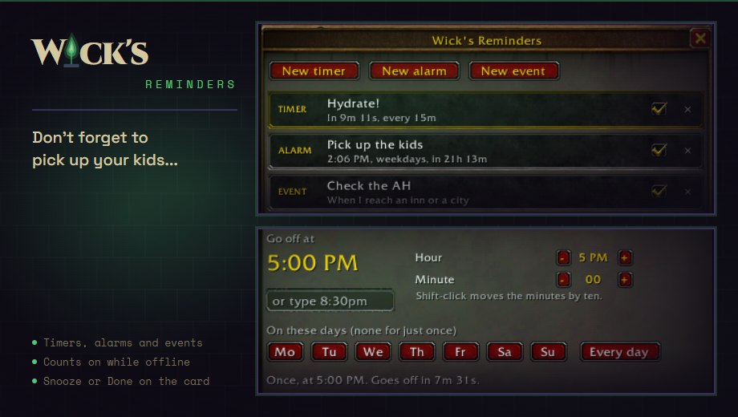

# Wick's Reminders

> Timers, alarms and reminders for World of Warcraft that keep counting between sessions. TBC Classic Anniversary and Forever.

Part of the **[Wick suite](https://github.com/Wicks-mods/WickSuite)**: precision addons built around a single fel-green-on-deep-purple aesthetic. Built on [WickCore](https://github.com/Wicks-mods/WickCore).

## What it does

- **Timers.** Ten minutes for the auction house, half an hour for a
  stretch. One click on a preset or type any length. A timer can start
  again each time it ends.
- **Alarms.** A time of day, once or on the days you pick: raid night
  on Mondays and Thursdays, an alarm every evening. Your computer's clock
  or the realm's.
- **Event reminders.** The next time you log in, enter a zone, reach an
  inn, open a mailbox, the bank or the auction house, talk to a vendor or
  a trainer, finish a fight, reach a level, or when the dailies or the
  raids reset. Once, or every time.
- **They keep counting while you are offline.** Anything that came due
  while you were away goes off when you log back in, marked as missed.
- **Alerts you will notice.** A card with Snooze and Done, a sound on the
  master channel, the words in large letters, a chat line and a taskbar
  flash. Alarms ring until you answer. Each can be turned off.
- **One character or all of them.** Reminders are shared across your
  account unless you make one for a single character.

The window and the alerts follow the look and theme you pick under Wick's
Mods in the game's Options. The suite's launcher opens the window; a
broker display shows the next countdown.

## Install

Requires **[WickCore](https://github.com/Wicks-mods/WickCore)**. Extract both
folders into `World of Warcraft\_anniversary_\Interface\AddOns\`.

## Usage

Everything is in the window. For a quick one from chat:

| Command | Effect |
|---|---|
| `/remind` | Open the window |
| `/remind 10m check the auction house` | A timer (90s, 45m, 1h30m) |
| `/remind every 30m stretch` | A timer that starts again |
| `/remind 20:30 raid invites` | An alarm (8:30pm works too) |
| `/remind daily 20:30 raid invites` | An alarm every day |
| `/remind login check the mail` | The next time you log in |
| `/remind list` | Everything set, in chat |
| `/remind test` | Show a test alert |
| `/remind options` | The options page |

`/reminder`, `/reminders` and `/wrem` are the same command.

## License

Code is MIT. The Wick name, logomark and visual system are trademarks; see
[LICENSE](LICENSE).
